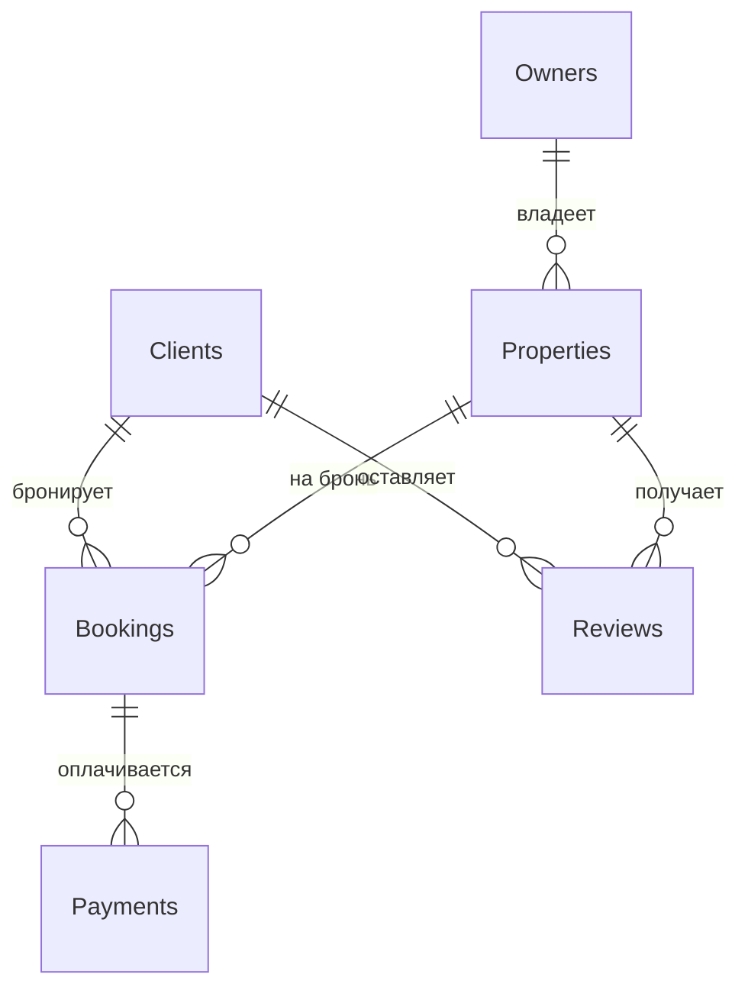
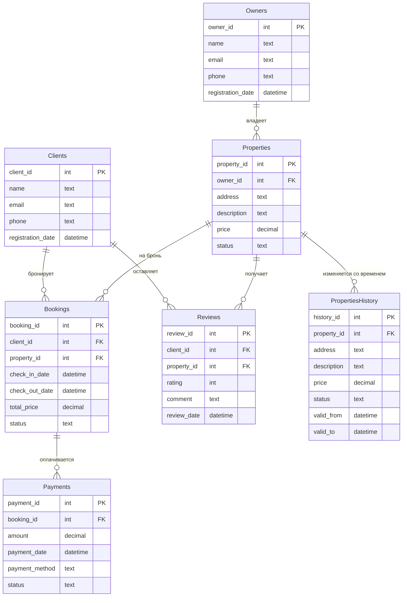

# База данных для онлайн-площадки аренды жилья

Выполнил: Пономарев Никита

## Описание структуры базы данных

Эта база данных предназначена для управления онлайн-площадкой аренды жилья. Она включает информацию о владельцах жилья, клиентах, объектах недвижимости, бронированиях, оплатах и отзывах. Основная цель — обеспечить эффективное взаимодействие между пользователями (владельцами и клиентами), а также хранить историю изменений для ключевых сущностей, таких как недвижимость и бронирования.

### Таблицы базы данных

1. **Владельцы жилья (Owners)**  
   Содержит информацию о владельцах недвижимости:  
   - `owner_id` (PK) — уникальный ID владельца  
   - `name` — имя владельца  
   - `email` - email владельца
   - `phone` - номер телефона
   - `registration_date` — дата регистрации  

2. **Клиенты (Clients)**  
   Содержит информацию о клиентах, бронирующих жилье:  
   - `client_id` (PK) — уникальный ID клиента  
   - `name` — имя клиента  
   - `email` - email клиента
   - `phone` - номер телефона  
   - `registration_date` — дата регистрации  

3. **Недвижимость (Properties)**  
   Содержит информацию о сдаваемых объектах:  
   - `property_id` (PK) — уникальный ID недвижимости  
   - `owner_id` (FK → Owners) — ID владельца  
   - `address` — адрес объекта  
   - `description` — описание объекта  
   - `price` — цена
   - `status` — статус  

4. **Сделки по бронированию (Bookings)**  
   Содержит информацию о бронированиях:  
   - `booking_id` (PK) — уникальный ID бронирования  
   - `client_id` (FK → Clients) — ID клиента  
   - `property_id` (FK → Properties) — ID недвижимости  
   - `check_in_date` — дата заезда  
   - `check_out_date` — дата выезда  
   - `total_price` — общая стоимость
   - `status` - статуc бронирования

5. **Оплаты (Payments)**  
   Содержит информацию об оплатах:  
   - `payment_id` (PK) — уникальный ID платежа  
   - `booking_id` (FK → Bookings) — ID бронирования  
   - `amount` — сумма платежа  
   - `payment_date` — дата платежа  
   - `payment_method` — метод оплаты
   - `status` - статус платежа

6. **Отзывы (Reviews)**  
   Содержит отзывы клиентов о недвижимости:  
   - `review_id` (PK) — уникальный ID отзыва  
   - `client_id` (FK → Clients) — ID клиента  
   - `property_id` (FK → Properties) — ID недвижимости  
   - `rating` — оценка 
   - `comment` — комментарий  
   - `review_date` — дата отзыва  

---

## 1. Концептуальная модель

### Описание связей:
- **Владельцы жилья** владеют одной или несколькими **Недвижимостями**.
- **Клиенты** создают **Сделки по бронированию** для аренды **Недвижимости**.
- **Сделки по бронированию** связаны с одной или несколькими **Оплатами**.
- **Клиенты** оставляют **Отзывы** о **Недвижимости**.

---

## 2. Логическая модель

### Описание логической модели
Логическая модель включает основные сущности с их атрибутами и внешними ключами (FK), которые обеспечивают связь между таблицами. Добавлена таблица `PropertiesHistory` для хранения истории изменений недвижимости.

### Нормальная форма
База данных приведена к **третьей нормальной форме (3NF)**.  
**Обоснование выбора 3NF:**
- **1NF**: Все атрибуты атомарны (нет повторяющихся групп).
- **2NF**: Нет частичной зависимости.
- **3NF**: Устранены транзитивные зависимости (например, `address` и `price_per_night` зависят только от `property_id`, а не от других атрибутов).  
3NF выбрана, чтобы минимизировать избыточность данных и обеспечить целостность, что особенно важно для управления бронированиями и отзывами.

### Тип версионирования
Выбран тип версионирования с использованием **исторических таблиц**.  
- Версионирование реализовано в таблице `PropertiesHistory`, которая хранит историю изменений для таблицы `Properties` (например, изменение цены или статуса доступности).  
- Атрибуты `valid_from` и `valid_to` указывают период действия каждой записи.
