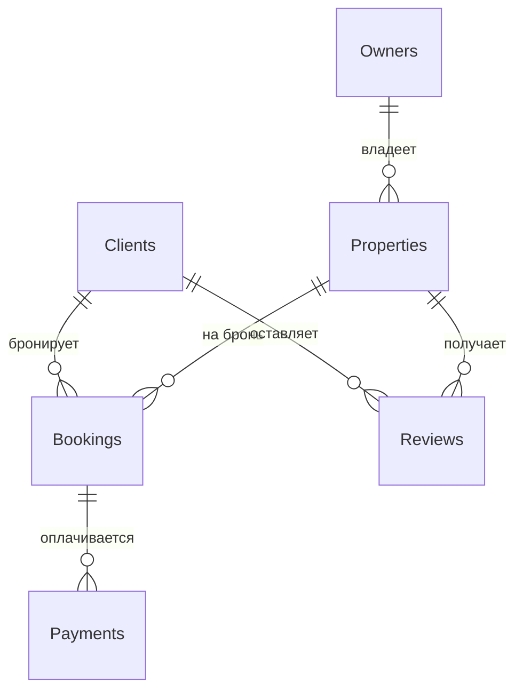

# База данных для онлайн-площадки аренды жилья

Выполнил: Пономарев Никита

## Описание структуры базы данных

Эта база данных предназначена для управления онлайн-площадкой аренды жилья. Она включает информацию о владельцах жилья, клиентах, объектах недвижимости, бронированиях, оплатах и отзывах. Основная цель — обеспечить эффективное взаимодействие между пользователями (владельцами и клиентами), а также хранить историю изменений для ключевых сущностей, таких как недвижимость и бронирования.

### Таблицы базы данных

1. **Владельцы жилья (Owners)**  
   Содержит информацию о владельцах недвижимости:  
   - `owner_id` (PK) — уникальный ID владельца  
   - `name` — имя владельца  
   - `email` - email владельца
   - `phone` - номер телефона
   - `registration_date` — дата регистрации  

2. **Клиенты (Clients)**  
   Содержит информацию о клиентах, бронирующих жилье:  
   - `client_id` (PK) — уникальный ID клиента  
   - `name` — имя клиента  
   - `email` - email клиента
   - `phone` - номер телефона  
   - `registration_date` — дата регистрации  

3. **Недвижимость (Properties)**  
   Содержит информацию о сдаваемых объектах:  
   - `property_id` (PK) — уникальный ID недвижимости  
   - `owner_id` (FK → Owners) — ID владельца  
   - `address` — адрес объекта  
   - `description` — описание объекта  
   - `price` — цена
   - `status` — статус  

4. **Сделки по бронированию (Bookings)**  
   Содержит информацию о бронированиях:  
   - `booking_id` (PK) — уникальный ID бронирования  
   - `client_id` (FK → Clients) — ID клиента  
   - `property_id` (FK → Properties) — ID недвижимости  
   - `check_in_date` — дата заезда  
   - `check_out_date` — дата выезда  
   - `total_price` — общая стоимость
   - `status` - статуc бронирования

5. **Оплаты (Payments)**  
   Содержит информацию об оплатах:  
   - `payment_id` (PK) — уникальный ID платежа  
   - `booking_id` (FK → Bookings) — ID бронирования  
   - `amount` — сумма платежа  
   - `payment_date` — дата платежа  
   - `payment_method` — метод оплаты
   - `status` - статус платежа

6. **Отзывы (Reviews)**  
   Содержит отзывы клиентов о недвижимости:  
   - `review_id` (PK) — уникальный ID отзыва  
   - `client_id` (FK → Clients) — ID клиента  
   - `property_id` (FK → Properties) — ID недвижимости  
   - `rating` — оценка 
   - `comment` — комментарий  
   - `review_date` — дата отзыва  

---

## 1. Концептуальная модель

### Описание связей:
- **Владельцы жилья** владеют одной или несколькими **Недвижимостями**.
- **Клиенты** создают **Сделки по бронированию** для аренды **Недвижимости**.
- **Сделки по бронированию** связаны с одной или несколькими **Оплатами**.
- **Клиенты** оставляют **Отзывы** о **Недвижимости**.

---

## 2. Логическая модель

### Описание логической модели
Логическая модель включает основные сущности с их атрибутами и внешними ключами (FK), которые обеспечивают связь между таблицами. Добавлена таблица `PropertiesHistory` для хранения истории изменений недвижимости.

### Нормальная форма
База данных приведена к **третьей нормальной форме (3NF)**.  
**Обоснование выбора 3NF:**
- **1NF**: Все атрибуты атомарны (нет повторяющихся групп).
- **2NF**: Нет частичной зависимости.
- **3NF**: Устранены транзитивные зависимости (например, `address` и `price_per_night` зависят только от `property_id`, а не от других атрибутов).  
3NF выбрана, чтобы минимизировать избыточность данных и обеспечить целостность, что особенно важно для управления бронированиями и отзывами.

### Тип версионирования
Выбран тип версионирования с использованием **исторических таблиц**.  
- Версионирование реализовано в таблице `PropertiesHistory`, которая хранит историю изменений для таблицы `Properties` (например, изменение цены или статуса доступности).  
- Атрибуты `valid_from` и `valid_to` указывают период действия каждой записи.

## 3. Физическая Модель
| Owners (Владельцы жилья)                           |                         |               |                                     |
|----------------------------------------------------|-------------------------|---------------|-------------------------------------|
| Название                                           | Описание                | Тип данных    | Ограничения                         |
| owner_id                                           | ID владельца            | SERIAL        | PK                                  |
| name                                               | Имя владельца           | TEXT          | NOT NULL                            |
| email                                              | Email владельца         | TEXT          | UNIQUE, NOT NULL                    |
| phone                                              | Телефон владельца       | TEXT          |                                     |
| registration_date                                  | Дата регистрации        | TIMESTAMP     | NOT NULL                            |
|                                                    |                         |               |                                     |
| Clients (Клиенты)                                  |                         |               |                                     |
| Название                                           | Описание                | Тип данных    | Ограничения                         |
| client_id                                          | ID клиента              | SERIAL        | PK                                  |
| name                                               | Имя клиента             | TEXT          | NOT NULL                            |
| email                                              | Email клиента           | TEXT          |  UNIQUE, NOT NULL                   |
| phone                                              | Телефон клиента         | TEXT          |                                     |
| registration_date                                  | Дата регистрации        | TIMESTAMP     | NOT NULL                            |
|                                                    |                         |               |                                     |
| Properties (Недвижимость)                          |                         |               |                                     |
| Название                                           | Описание                | Тип данных    | Ограничения                         |
| property_id                                        | ID недвижимости         | SERIAL        | PK                                  |
| owner_id                                           | ID владельца            | INTEGER       | FK → Owners(owner_id)               |
| address                                            | Адрес                   | TEXT          | NOT NULL                            |
| description                                        | Описание                | TEXT          |                                     |
| price                                              | Цена                    | NUMERIC(10,3) | NOT NULL                            |
| status                                             | Статус                  | TEXT          | CHECK (available/unavailable)       |
|                                                    |                         |               |                                     |
| Bookings (Бронирования)                            |                         |               |                                     |
| Название                                           | Описание                | Тип данных    | Ограничения                         |
| booking_id                                         | ID бронирования         | SERIAL        | PK                                  |
| client_id                                          | ID клиента              | INTEGER       | FK → Clients(client_id)             |
| property_id                                        | ID недвижимости         | INTEGER       | FK → Properties(property_id)        |
| check_in_date                                      | Дата заезда             | DATE          | NOT NULL                            |
| check_out_date                                     | Дата выезда             | DATE          | NOT NULL                            |
| total_price                                        | Общая стоимость         | NUMERIC(10,3) | NOT NULL                            |
| status                                             | Статус бронирования     | TEXT          | CHECK (pending/confirmed/cancelled) |
|                                                    |                         |               |                                     |
| Payments (Оплаты)                                  |                         |               |                                     |
| Название                                           | Описание                | Тип данных    | Ограничения                         |
| payment_id                                         | ID платежа              | SERIAL        | PK                                  |
| booking_id                                         | ID бронирования         | INTEGER       | FK → Bookings(booking_id)           |
| amount                                             | Сумма платежа           | NUMERIC(10,3) | NOT NULL                            |
| payment_date                                       | Дата платежа            | TIMESTAMP     | NOT NULL                            |
| payment_method                                     | Метод оплаты            | TEXT          | CHECK (card/cash/bank_transfer)     |
| status                                             | Статус платежа          | TEXT          | CHECK (completed/pending/failed)    |
|                                                    |                         |               |                                     |
| Reviews (Отзывы)                                   |                         |               |                                     |
| Название                                           | Описание                | Тип данных    | Ограничения                         |
| review_id                                          | ID отзыва               | SERIAL        | PK                                  |
| client_id                                          | ID клиента              | INTEGER       | FK → Clients(client_id)             |
| property_id                                        | ID недвижимости         | INTEGER       | FK → Properties(property_id)        |
| rating                                             | Оценка                  | NUMERIC(3, 2) | CHECK (rating BETWEEN 1 AND 5)      |
| comment                                            | Комментарий             | TEXT          |                                     |
| review_date                                        | Дата отзыва             | TIMESTAMP     | NOT NULL                            |
|                                                    |                         |               |                                     |
| PropertiesHistory (История изменений недвижимости) |                         |               |                                     |
| Название                                           | Описание                | Тип данных    | Ограничения                         |
| history_id                                         | ID записи истории       | SERIAL        | PK                                  |
| property_id                                        | ID недвижимости         | INTEGER       | FK → Properties(property_id)        |
| address                                            | Адрес                   | TEXT          | NOT NULL                            |
| description                                        | Описание                | TEXT          |                                     |
| price                                              | Цена                    | NUMERIC(10,3) | NOT NULL                            |
| status                                             | Статус                  | TEXT          | CHECK (available/unavailable)       |
| valid_from                                         | Дата начала действия    | TIMESTAMP     | NOT NULL                            |
| valid_to                                           | Дата окончания действия | TIMESTAMP     |                                     |
