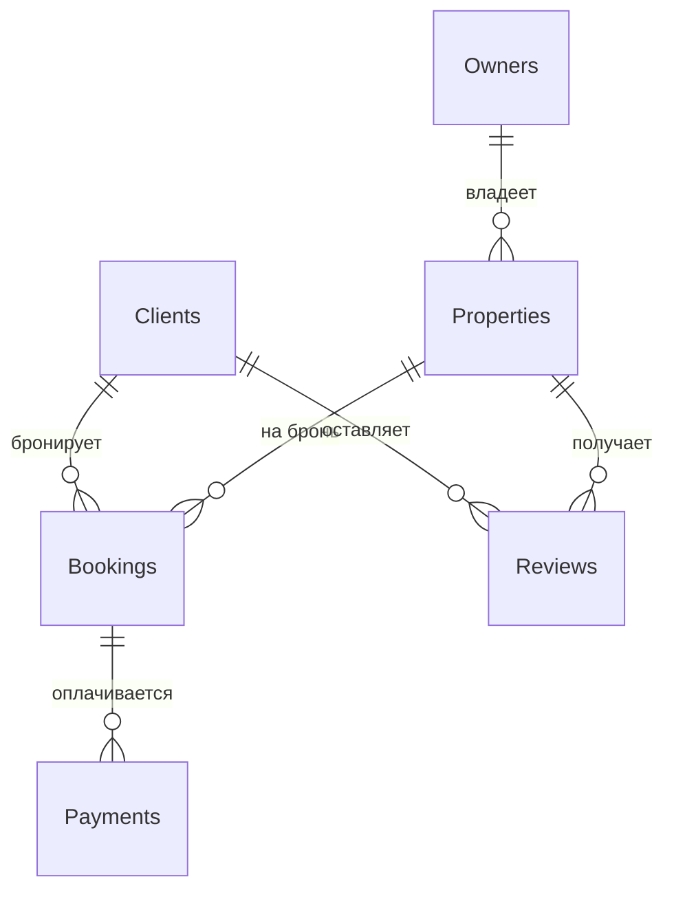

# База данных для онлайн-площадки аренды жилья

Выполнил: Пономарев Никита

## Описание структуры базы данных

Эта база данных предназначена для управления онлайн-площадкой аренды жилья. Она включает информацию о владельцах жилья, клиентах, объектах недвижимости, бронированиях, оплатах и отзывах. Основная цель — обеспечить эффективное взаимодействие между пользователями (владельцами и клиентами), а также хранить историю изменений для ключевых сущностей, таких как недвижимость и бронирования.

### Таблицы базы данных

1. **Владельцы жилья (Owners)**  
   Содержит информацию о владельцах недвижимости:  
   - `owner_id` (PK) — уникальный ID владельца  
   - `name` — имя владельца  
   - `email` - email владельца
   - `phone` - номер телефона
   - `registration_date` — дата регистрации  

2. **Клиенты (Clients)**  
   Содержит информацию о клиентах, бронирующих жилье:  
   - `client_id` (PK) — уникальный ID клиента  
   - `name` — имя клиента  
   - `email` - email клиента
   - `phone` - номер телефона  
   - `registration_date` — дата регистрации  

3. **Недвижимость (Properties)**  
   Содержит информацию о сдаваемых объектах:  
   - `property_id` (PK) — уникальный ID недвижимости  
   - `owner_id` (FK → Owners) — ID владельца  
   - `address` — адрес объекта  
   - `description` — описание объекта  
   - `price` — цена
   - `status` — статус  

4. **Сделки по бронированию (Bookings)**  
   Содержит информацию о бронированиях:  
   - `booking_id` (PK) — уникальный ID бронирования  
   - `client_id` (FK → Clients) — ID клиента  
   - `property_id` (FK → Properties) — ID недвижимости  
   - `check_in_date` — дата заезда  
   - `check_out_date` — дата выезда  
   - `total_price` — общая стоимость
   - `status` - статуc бронирования

5. **Оплаты (Payments)**  
   Содержит информацию об оплатах:  
   - `payment_id` (PK) — уникальный ID платежа  
   - `booking_id` (FK → Bookings) — ID бронирования  
   - `amount` — сумма платежа  
   - `payment_date` — дата платежа  
   - `payment_method` — метод оплаты
   - `status` - статус платежа

6. **Отзывы (Reviews)**  
   Содержит отзывы клиентов о недвижимости:  
   - `review_id` (PK) — уникальный ID отзыва  
   - `client_id` (FK → Clients) — ID клиента  
   - `property_id` (FK → Properties) — ID недвижимости  
   - `rating` — оценка 
   - `comment` — комментарий  
   - `review_date` — дата отзыва  

---

## 1. Концептуальная модель


### Описание связей:
- **Владельцы жилья** владеют одной или несколькими **Недвижимостями**.
- **Клиенты** создают **Сделки по бронированию** для аренды **Недвижимости**.
- **Сделки по бронированию** связаны с одной или несколькими **Оплатами**.
- **Клиенты** оставляют **Отзывы** о **Недвижимости**.

---

## 2. Логическая модель


### Описание логической модели
Логическая модель включает основные сущности с их атрибутами и внешними ключами (FK), которые обеспечивают связь между таблицами. Добавлена таблица `PropertiesHistory` для хранения истории изменений недвижимости.

### Нормальная форма
База данных приведена к **третьей нормальной форме (3NF)**.  
**Обоснование выбора 3NF:**
- **1NF**: Все атрибуты атомарны (нет повторяющихся групп).
- **2NF**: Нет частичной зависимости.
- **3NF**: Устранены транзитивные зависимости (например, `address` и `price_per_night` зависят только от `property_id`, а не от других атрибутов).  
3NF выбрана, чтобы минимизировать избыточность данных и обеспечить целостность, что особенно важно для управления бронированиями и отзывами.

### Тип версионирования
Выбран тип версионирования с использованием **исторических таблиц**.  
- Версионирование реализовано в таблице `PropertiesHistory`, которая хранит историю изменений для таблицы `Properties` (например, изменение цены или статуса доступности).  
- Атрибуты `valid_from` и `valid_to` указывают период действия каждой записи.


## 3. Физическая Модель
| Owners (Владельцы жилья)                           |                         |               |                                     |
|----------------------------------------------------|-------------------------|---------------|-------------------------------------|
| Название                                           | Описание                | Тип данных    | Ограничения                         |
| owner_id                                           | ID владельца            | SERIAL        | PK                                  |
| name                                               | Имя владельца           | TEXT          | NOT NULL                            |
| email                                              | Email владельца         | TEXT          | UNIQUE, NOT NULL                    |
| phone                                              | Телефон владельца       | TEXT          |                                     |
| registration_date                                  | Дата регистрации        | TIMESTAMP     | NOT NULL                            |


| Clients (Клиенты)                                  |                         |               |                                     |
|----------------------------------------------------|-------------------------|---------------|-------------------------------------|
| Название                                           | Описание                | Тип данных    | Ограничения                         |
| client_id                                          | ID клиента              | SERIAL        | PK                                  |
| name                                               | Имя клиента             | TEXT          | NOT NULL                            |
| email                                              | Email клиента           | TEXT          |  UNIQUE, NOT NULL                   |
| phone                                              | Телефон клиента         | TEXT          |                                     |
| registration_date                                  | Дата регистрации        | TIMESTAMP     | NOT NULL                            |


| Properties (Недвижимость)                          |                         |               |                                     |
|----------------------------------------------------|-------------------------|---------------|-------------------------------------|
| Название                                           | Описание                | Тип данных    | Ограничения                         |
| property_id                                        | ID недвижимости         | SERIAL        | PK                                  |
| owner_id                                           | ID владельца            | INTEGER       | FK → Owners(owner_id)               |
| address                                            | Адрес                   | TEXT          | NOT NULL                            |
| description                                        | Описание                | TEXT          |                                     |
| price                                              | Цена                    | NUMERIC(10,3) | NOT NULL                            |
| status                                             | Статус                  | TEXT          | CHECK (available/unavailable)       |

| Bookings (Бронирования)                            |                         |               |                                     |
|----------------------------------------------------|-------------------------|---------------|-------------------------------------|
| Название                                           | Описание                | Тип данных    | Ограничения                         |
| booking_id                                         | ID бронирования         | SERIAL        | PK                                  |
| client_id                                          | ID клиента              | INTEGER       | FK → Clients(client_id)             |
| property_id                                        | ID недвижимости         | INTEGER       | FK → Properties(property_id)        |
| check_in_date                                      | Дата заезда             | DATE          | NOT NULL                            |
| check_out_date                                     | Дата выезда             | DATE          | NOT NULL                            |
| total_price                                        | Общая стоимость         | NUMERIC(10,3) | NOT NULL                            |
| status                                             | Статус бронирования     | TEXT          | CHECK (pending/confirmed/cancelled) |

| Payments (Оплаты)                                  |                         |               |                                     |
|----------------------------------------------------|-------------------------|---------------|-------------------------------------|
| Название                                           | Описание                | Тип данных    | Ограничения                         |
| payment_id                                         | ID платежа              | SERIAL        | PK                                  |
| booking_id                                         | ID бронирования         | INTEGER       | FK → Bookings(booking_id)           |
| amount                                             | Сумма платежа           | NUMERIC(10,3) | NOT NULL                            |
| payment_date                                       | Дата платежа            | TIMESTAMP     | NOT NULL                            |
| payment_method                                     | Метод оплаты            | TEXT          | CHECK (card/cash/bank_transfer)     |
| status                                             | Статус платежа          | TEXT          | CHECK (completed/pending/failed)    |

| Reviews (Отзывы)                                   |                         |               |                                     |
|----------------------------------------------------|-------------------------|---------------|-------------------------------------|
| Название                                           | Описание                | Тип данных    | Ограничения                         |
| review_id                                          | ID отзыва               | SERIAL        | PK                                  |
| client_id                                          | ID клиента              | INTEGER       | FK → Clients(client_id)             |
| property_id                                        | ID недвижимости         | INTEGER       | FK → Properties(property_id)        |
| rating                                             | Оценка                  | NUMERIC(3, 2) | CHECK (rating BETWEEN 1 AND 5)      |
| comment                                            | Комментарий             | TEXT          |                                     |
| review_date                                        | Дата отзыва             | TIMESTAMP     | NOT NULL                            |

| PropertiesHistory (История изменений недвижимости) |                         |               |                                     |
|----------------------------------------------------|-------------------------|---------------|-------------------------------------|
| Название                                           | Описание                | Тип данных    | Ограничения                         |
| history_id                                         | ID записи истории       | SERIAL        | PK                                  |
| property_id                                        | ID недвижимости         | INTEGER       | FK → Properties(property_id)        |
| address                                            | Адрес                   | TEXT          | NOT NULL                            |
| description                                        | Описание                | TEXT          |                                     |
| price                                              | Цена                    | NUMERIC(10,3) | NOT NULL                            |
| status                                             | Статус                  | TEXT          | CHECK (available/unavailable)       |
| valid_from                                         | Дата начала действия    | TIMESTAMP     | NOT NULL                            |
| valid_to                                           | Дата окончания действия | TIMESTAMP     |                                     |

## Скрипты
### DDL-скрипт
### [ddl.sql](scripts/ddl.sql)
```postgresql
-- Таблица владельцев жилья
CREATE TABLE Owners (
    owner_id SERIAL PRIMARY KEY,
    name TEXT NOT NULL,
    email TEXT UNIQUE NOT NULL,
    phone TEXT,
    registration_date TIMESTAMP NOT NULL
);

-- Таблица клиентов
CREATE TABLE Clients (
    client_id SERIAL PRIMARY KEY,
    name TEXT NOT NULL,
    email TEXT UNIQUE NOT NULL,
    phone TEXT,
    registration_date TIMESTAMP NOT NULL
);

-- Таблица недвижимости
CREATE TABLE Properties (
    property_id SERIAL PRIMARY KEY,
    owner_id INT NOT NULL REFERENCES Owners(owner_id) ON DELETE CASCADE,
    address TEXT NOT NULL,
    description TEXT,
    price NUMERIC(10, 3) NOT NULL,
    status TEXT CHECK (status IN ('available', 'unavailable'))
);

-- Таблица бронирований
CREATE TABLE Bookings (
    booking_id SERIAL PRIMARY KEY,
    client_id INT NOT NULL REFERENCES Clients(client_id) ON DELETE CASCADE,
    property_id INT NOT NULL REFERENCES Properties(property_id) ON DELETE CASCADE,
    check_in_date DATE NOT NULL,
    check_out_date DATE NOT NULL,
    total_price NUMERIC(10, 3) NOT NULL,
    status TEXT CHECK (status IN ('pending', 'confirmed', 'cancelled'))
);

-- Таблица оплат
CREATE TABLE Payments (
    payment_id SERIAL PRIMARY KEY,
    booking_id INT NOT NULL REFERENCES Bookings(booking_id) ON DELETE CASCADE,
    amount NUMERIC(10, 3) NOT NULL,
    payment_date TIMESTAMP NOT NULL,
    payment_method TEXT CHECK (payment_method IN ('card', 'cash', 'bank_transfer')),
    status TEXT CHECK (status IN ('completed', 'pending', 'failed'))
);

-- Таблица отзывов
CREATE TABLE Reviews (
    review_id SERIAL PRIMARY KEY,
    client_id INT NOT NULL REFERENCES Clients(client_id) ON DELETE CASCADE,
    property_id INT NOT NULL REFERENCES Properties(property_id) ON DELETE CASCADE,
    rating NUMERIC(3, 2) CHECK (rating BETWEEN 1 AND 5),
    comment TEXT,
    review_date TIMESTAMP NOT NULL
);

-- Таблица истории изменений недвижимости
CREATE TABLE PropertiesHistory (
    history_id SERIAL PRIMARY KEY,
    property_id INT NOT NULL REFERENCES Properties(property_id) ON DELETE CASCADE,
    address TEXT NOT NULL,
    description TEXT,
    price NUMERIC(10, 3) NOT NULL,
    status TEXT CHECK (status IN ('available', 'unavailable')),
    valid_from TIMESTAMP NOT NULL,
    valid_to TIMESTAMP
);
```

### Запросы к схеме
#### 1) Выбор доступных объектов недвижимости с ценой выше/ниже заданного значения(в примере ниже 150)
```postgresql
SELECT p.property_id,
       p.address,
       p.price
FROM Properties p
WHERE p.status = 'available'
  AND p.price < 150.00
ORDER BY p.price ASC;
```
#### 2) Подсчёт количества бронирований по каждому объекту с добавлением ранжирования по убыванию
```postgresql
SELECT
    property_id,
    address,
    COUNT(booking_id) AS bookings_count,
    RANK() OVER (ORDER BY COUNT(booking_id) DESC) AS rank
FROM Properties
LEFT JOIN Bookings USING (property_id)
GROUP BY property_id;
```
#### 3) Вычисление средней оценки для объектов, где она выше 4
```postgresql
SELECT p.property_id,
       p.address,
       ROUND(AVG(r.rating), 2) AS average_rating
FROM Properties p
JOIN Reviews r ON p.property_id = r.property_id
GROUP BY p.property_id, p.address
HAVING AVG(r.rating) > 4.0
ORDER BY average_rating DESC;
```
#### 4) Поиск клиентов, которые бронировали жильё больше одного раза
```postgresql
`SELECT client_id, name
FROM Clients
WHERE client_id IN (
    SELECT client_id
    FROM Bookings
    GROUP BY client_id
    HAVING COUNT(booking_id) > 1
)
ORDER BY name;
```
#### 5) Поиск владельцев, у которых средняя цена объектов выше средней по рынку
```postgresql
SELECT o.owner_id,
       o.name,
       ROUND(AVG(pr.price), 2) AS avg_price
FROM Owners o
JOIN Properties pr ON o.owner_id = pr.owner_id
GROUP BY o.owner_id, o.name
HAVING AVG(pr.price) > (SELECT AVG(price) FROM Properties)
ORDER BY avg_price DESC;
```
#### 6) Вывод информации о бронированиях: клиент, объект, даты и стоимость
```postgresql
SELECT b.booking_id,
       c.name AS client_name,
       p.address AS property_address,
       b.check_in_date,
       b.check_out_date,
       b.total_price
FROM Bookings b
INNER JOIN Clients c ON b.client_id = c.client_id
INNER JOIN Properties p ON b.property_id = p.property_id;
```
#### 7) Нахождение объектов, у которых есть отзывы с рейтингом ниже 4
```postgresql
SELECT DISTINCT p.property_id, p.address, r.rating
FROM Properties p
JOIN Reviews r ON p.property_id = r.property_id
WHERE r.rating < 4;
```
#### 8) Получение списка клиентов и объектов, к которым они оставили отзывы
```postgresql
SELECT c.client_id,
       c.name,
       r.review_id,
       r.rating,
       r.review_date
FROM Clients c
FULL JOIN Reviews r ON c.client_id = r.client_id
ORDER BY c.client_id;
```
#### 9) Подсчёт средней длительности бронирования для каждого объекта
```postgresql
SELECT p.property_id,
       p.address,
       ROUND(AVG(b.check_out_date - b.check_in_date), 0) AS avg_duration_days
FROM Properties p
JOIN Bookings b ON p.property_id = b.property_id
GROUP BY p.property_id, p.address
ORDER BY avg_duration_days DESC;
```
#### 10) Анализ истории изменения цен по каждому объекту
```postgresql
SELECT property_id,
       TO_CHAR(valid_from, 'YYYY-MM-DD') AS change_date,
       old_price,
       changed_price,
       ROUND(((changed_price - old_price) / NULLIF(old_price, 0)) * 100, 2) AS change_percent
FROM (
    SELECT property_id,
           valid_from,
           price AS changed_price,
           LAG(price) OVER (PARTITION BY property_id ORDER BY valid_from) AS old_price
    FROM PropertiesHistory
) AS sub
WHERE old_price IS NOT NULL
ORDER BY property_id, valid_from;
```
#### 11) Вывод 10 объектов начиная с 11‑го по цене
```postgresql
SELECT
    p.property_id,
    p.address,
    p.price,
    ROUND(AVG(r.rating) OVER (PARTITION BY p.property_id), 2) AS avg_rating
FROM Properties p
LEFT JOIN Reviews r ON p.property_id = r.property_id
ORDER BY p.price DESC
LIMIT 10 OFFSET 10;
```
#### 12) Получение объектов и их владельцев, у которых бронированре не отменялось
```postgresql
SELECT DISTINCT
    o.owner_id,
    o.name AS owner_name,
    p.address
FROM Bookings b
RIGHT JOIN
    Properties p ON b.property_id = p.property_id
JOIN
    Owners o ON p.owner_id = o.owner_id
WHERE
    EXISTS (
        SELECT 1
        FROM Bookings b2
        WHERE b2.property_id = p.property_id
    )
    AND NOT EXISTS (
        SELECT 1
        FROM Bookings b3
        WHERE b3.property_id = p.property_id
          AND b3.status = 'cancelled'
    )
ORDER BY o.owner_id;
```
#### 13) Поиск объектов с одинаковой ценой
```postgresql
SELECT a.property_id, a.address, b.property_id, b.address, a.price
FROM Properties a
JOIN Properties b ON a.price = b.price
WHERE a.property_id < b.property_id;
```
### DML-скрипты
### [dmls](scripts/dmls)
```postgresql
-- Вставка данных для таблицы Owners
INSERT INTO Owners (name, email, phone, registration_date) VALUES
('Иванов Сергей', 's.ivanov@mail.com', '+7-900-111-1111', '2025-01-10 10:00:00'),
('Петрова Анна', 'a.petrova@mail.com', ' +7-900-222-2222', '2025-01-12 11:00:00'),
('Сидоров Михаил', 'm.sidorov@mail.com', '+7-900-333-3333', '2025-02-01 09:30:00'),
('Кузнецова Ольга', 'o.kuznetsova@mail.com', '+7-900-444-4444', '2025-02-05 14:15:00'),
('Новиков Дмитрий', 'd.novikov@mail.com', '+7-900-555-5555', '2025-03-07 16:45:00'),
('Смирнова Елена', 'e.smirnova@mail.com', '+7-900-666-6666', '2025-03-10 12:00:00'),
('Волков Алексей', 'a.volkov@mail.com', '+7-900-777-7777', '2025-04-01 10:20:00'),
('Фёдоров Никита', 'n.fedorov@mail.com', '+7-900-888-8888', '2025-04-03 13:30:00'),
('Морозова Виктория', 'v.morozova@mail.com', '+7-900-999-9999', '2025-04-05 09:00:00'),
('Егоров Павел', 'p.egorov@mail.com', '+7-900-101-0101', '2025-05-01 15:00:00'),
('Колесникова Мария', 'm.kolesnikova@mail.com', '+7-900-202-0202', '2025-05-05 11:15:00'),
('Лебедев Иван', 'i.lebedev@mail.com', '+7-900-303-0303', '2025-05-10 16:50:00'),
('Борисов Сергей', 's.borisov@mail.com', '+7-900-404-0404', '2025-06-01 12:30:00'),
('Дмитриева Светлана', 's.dmitrieva@mail.com', '+7-900-505-0505', '2025-06-05 14:40:00'),
('Соколова Наталья', 'n.sokolova@mail.com', '+7-900-606-0606', '2025-06-10 10:10:00');

-- Вставка данных для таблицы Clients
INSERT INTO Clients (name, email, phone, registration_date) VALUES
('Александров Максим', 'm.alex@mail.com', '+7-910-111-0001', '2025-01-15 10:00:00'),
('Бабушкина Юлия', 'y.babushkina@mail.com', '+7-910-222-0002', '2025-01-20 11:30:00'),
('Васильев Константин', 'k.vasiliev@mail.com', '+7-910-333-0003', '2025-02-02 09:20:00'),
('Григорьева Ирина', 'i.grigorieva@mail.com', '+7-910-444-0004', '2025-02-07 12:00:00'),
('Денисов Роман', 'r.denisov@mail.com', '+7-910-555-0005', '2025-03-11 16:00:00'),
('Ерофеева Анна', 'a.erofeeva@mail.com', '+7-910-666-0006', '2025-03-15 14:30:00'),
('Зайцев Михаил', 'm.zaytsev@mail.com', '+7-910-777-0007', '2025-04-05 10:15:00'),
('Иванова Марина', 'm.ivanova@mail.com', '+7-910-888-0008', '2025-04-07 13:40:00'),
('Крылова Оксана', 'o.krylovа@mail.com', '+7-910-999-0009', '2025-04-10 09:50:00'),
('Лукин Артём', 'a.lukin@mail.com', '+7-910-101-0010', '2025-05-02 15:20:00'),
('Макарова Светлана', 's.makarova@mail.com', '+7-910-202-0020', '2025-05-06 11:45:00'),
('Николаев Игорь', 'i.nikolaev@mail.com', '+7-910-303-0030', '2025-05-12 16:10:00'),
('Орлов Пётр', 'p.orlov@mail.com', '+7-910-404-0040', '2025-06-03 12:00:00'),
('Павлова Дарья', 'd.pavlova@mail.com', '+7-910-505-0050', '2025-06-07 14:55:00'),
('Романов Станислав', 's.romanov@mail.com', '+7-910-606-0060', '2025-06-12 10:30:00');

-- Вставка данных для таблицы Properties
INSERT INTO Properties (owner_id, address, description, price, status) VALUES
(1, 'ул. Ленина, д. 10, кв. 5', 'Квартира в центре города', 120.00, 'available'),
(2, 'пр. Мира, д. 15', 'Уютная студия', 90.50, 'available'),
(3, 'ул. Гагарина, д. 20', 'Двухкомнатная квартира с ремонтом', 150.75, 'available'),
(4, 'ул. Советская, д. 7', 'Квартира с видом на парк', 130.00, 'available'),
(5, 'ул. Победы, д. 2', 'Современная квартира в новом доме', 160.00, 'available'),
(6, 'ул. Первомайская, д. 5', 'Квартира для всей семьи', 140.25, 'available'),
(7, 'пр. Победы, д. 8', 'Студия рядом с метро', 80.00, 'available'),
(8, 'ул. Московская, д. 3', 'Квартира с дизайнерским ремонтом', 200.00, 'available'),
(9, 'ул. Красная, д. 12', 'Уютная квартира в историческом центре', 110.00, 'available'),
(10, 'ул. Чапаева, д. 9', 'Новая квартира с современными технологиями', 170.00, 'available'),
(11, 'ул. Гагарина, д. 30', 'Двухкомнатная квартира с балконом', 140.00, 'available'),
(12, 'пр. Лермонтова, д. 4', 'Квартира в тихом районе', 95.00, 'available'),
(13, 'ул. Садовая, д. 6', 'Роскошная квартира с мебелью', 250.00, 'available'),
(14, 'ул. Невского, д. 18', 'Квартира с прекрасным видом на город', 180.00, 'available'),
(15, 'ул. Центральная, д. 22', 'Компактная студия', 180.00, 'available');

-- Вставка данных для таблицы Bookings
INSERT INTO Bookings (client_id, property_id, check_in_date, check_out_date, total_price, status) VALUES
(1, 1, '2025-07-01', '2025-07-05', 480.00, 'confirmed'),
(2, 2, '2025-07-02', '2025-07-06', 362.00, 'confirmed'),
(3, 3, '2025-07-03', '2025-07-07', 603.00, 'pending'),
(4, 4, '2025-07-04', '2025-07-08', 520.00, 'confirmed'),
(5, 5, '2025-07-05', '2025-07-10', 800.00, 'cancelled'),
(6, 6, '2025-07-06', '2025-07-09', 420.75, 'confirmed'),
(7, 7, '2025-07-07', '2025-07-10', 240.00, 'confirmed'),
(8, 8, '2025-07-08', '2025-07-12', 800.00, 'pending'),
(9, 9, '2025-07-09', '2025-07-13', 440.00, 'confirmed'),
(10, 10, '2025-07-10', '2025-07-15', 850.00, 'confirmed'),
(11, 11, '2025-07-11', '2025-07-16', 700.00, 'confirmed'),
(12, 12, '2025-07-12', '2025-07-17', 475.00, 'confirmed'),
(13, 13, '2025-07-13', '2025-07-18', 1250.00, 'pending'),
(14, 14, '2025-07-14', '2025-07-19', 900.00, 'confirmed'),
(15, 15, '2025-07-15', '2025-07-20', 375.00, 'cancelled'),
(1, 2, '2025-07-16', '2025-07-20', 360.00, 'confirmed'),
(2, 3, '2025-07-17', '2025-07-21', 603.00, 'pending'),
(3, 4, '2025-07-18', '2025-07-22', 520.00, 'confirmed'),
(4, 5, '2025-07-19', '2025-07-23', 640.00, 'confirmed'),
(5, 6, '2025-07-20', '2025-07-24', 560.00, 'confirmed'),
(6, 7, '2025-07-21', '2025-07-25', 320.00, 'confirmed'),
(7, 8, '2025-07-22', '2025-07-26', 800.00, 'pending'),
(8, 9, '2025-07-23', '2025-07-27', 440.00, 'confirmed'),
(9, 10, '2025-07-24', '2025-07-28', 850.00, 'confirmed'),
(10, 11, '2025-07-25', '2025-07-29', 700.00, 'cancelled'),
(11, 12, '2025-07-26', '2025-07-30', 475.00, 'confirmed'),
(12, 13, '2025-07-27', '2025-08-01', 1250.00, 'confirmed'),
(13, 14, '2025-07-28', '2025-08-02', 900.00, 'confirmed'),
(14, 15, '2025-07-29', '2025-08-03', 375.00, 'pending'),
(15, 1, '2025-07-30', '2025-08-04', 480.00, 'confirmed');

-- Вставка данных для таблицы Payments
INSERT INTO Payments (booking_id, amount, payment_date, payment_method, status) VALUES
(1, 480.00, '2025-06-30 18:00:00', 'card', 'completed'),
(2, 362.00, '2025-07-01 12:00:00', 'cash', 'completed'),
(3, 603.00, '2025-07-02 14:00:00', 'bank_transfer', 'pending'),
(4, 520.00, '2025-07-03 16:00:00', 'card', 'completed'),
(5, 800.00, '2025-07-04 10:00:00', 'cash', 'failed'),
(6, 420.75, '2025-07-05 09:30:00', 'bank_transfer', 'completed'),
(7, 240.00, '2025-07-06 11:00:00', 'card', 'completed'),
(8, 800.00, '2025-07-07 15:00:00', 'cash', 'pending'),
(9, 440.00, '2025-07-08 14:00:00', 'card', 'completed'),
(10, 850.00, '2025-07-09 18:00:00', 'bank_transfer', 'completed'),
(11, 700.00, '2025-07-10 12:00:00', 'card', 'completed'),
(12, 475.00, '2025-07-11 16:00:00', 'cash', 'completed'),
(13, 1250.00, '2025-07-12 13:00:00', 'bank_transfer', 'pending'),
(14, 900.00, '2025-07-13 17:00:00', 'card', 'completed'),
(15, 375.00, '2025-07-14 10:30:00', 'cash', 'failed');

-- Вставка данных для таблицы Reviews
INSERT INTO Reviews (client_id, property_id, rating, comment, review_date) VALUES
(1, 1, 4.5, 'Отличное расположение и чисто', '2025-07-06 20:00:00'),
(2, 2, 4.0, 'Хорошая студия для краткосрочной аренды', '2025-07-07 21:00:00'),
(3, 3, 5.0, 'Просторная квартира, понравилось всё', '2025-07-08 19:30:00'),
(4, 4, 3.5, 'Средне, но уютно', '2025-07-09 18:45:00'),
(5, 5, 4.8, 'Рекомендую, всё на высшем уровне', '2025-07-10 20:10:00'),
(6, 6, 4.2, 'Хороший вариант для семейного отдыха', '2025-07-11 17:30:00'),
(7, 7, 3.8, 'Небольшая, но функциональная', '2025-07-12 16:25:00'),
(8, 8, 5.0, 'Роскошно и современно', '2025-07-13 19:00:00'),
(9, 9, 4.0, 'Расположение отличное, хотя интерьер староват', '2025-07-14 18:15:00'),
(10, 10, 4.9, 'Всё идеально, рекомендую', '2025-07-15 20:00:00'),
(11, 11, 4.3, 'Хорошее соотношение цены и качества', '2025-07-16 17:45:00'),
(12, 12, 3.9, 'Можно лучше, но в целом неплохо', '2025-07-17 16:30:00'),
(13, 13, 5.0, 'Идеально для отпуска', '2025-07-18 19:20:00'),
(14, 14, 4.6, 'Современное жильё с удобствами', '2025-07-19 18:40:00'),
(15, 15, 3.5, 'Бюджетный вариант, но немного шумно', '2025-07-20 17:10:00');

-- Вставка данных для таблицы PropertiesHistory
INSERT INTO PropertiesHistory (property_id, address, description, price, status, valid_from, valid_to) VALUES
(1, 'ул. Ленина, д. 10, кв. 5', 'Квартира в центре города', 115.00, 'available', '2025-01-01 00:00:00', '2025-03-01 00:00:00'),
(1, 'ул. Ленина, д. 10, кв. 5', 'Обновлённая квартира, новый ремонт', 120.00, 'available', '2025-03-01 00:00:00', NULL),

(2, 'пр. Мира, д. 15', 'Студия, без лишних удобств', 85.00, 'available', '2025-01-01 00:00:00', '2025-02-15 00:00:00'),
(2, 'пр. Мира, д. 15', 'Отремонтированная студия с мебелью', 90.50, 'available', '2025-02-15 00:00:00', NULL),

(3, 'ул. Гагарина, д. 20', 'Квартира с видом на город', 145.00, 'available', '2025-01-10 00:00:00', '2025-04-01 00:00:00'),
(3, 'ул. Гагарина, д. 20', 'Улучшенная планировка, новая мебель', 150.75, 'available', '2025-04-01 00:00:00', NULL),

(4, 'ул. Советская, д. 7', 'Квартира с видом на парк', 125.00, 'available', '2025-01-20 00:00:00', '2025-03-15 00:00:00'),
(4, 'ул. Советская, д. 7', 'Обновлённое жильё, улучшенные окна', 130.00, 'available', '2025-03-15 00:00:00', NULL),

(5, 'ул. Победы, д. 2', 'Современная квартира с базовым ремонтом', 155.00, 'available', '2025-02-01 00:00:00', '2025-04-10 00:00:00'),
(5, 'ул. Победы, д. 2', 'Квартира после капитального ремонта', 160.00, 'available', '2025-04-10 00:00:00', NULL),

-- Начальное состояние
(6, 'ул. Первомайская, д. 5', 'Уютная квартира для семьи', 100.00, 'available', '2025-01-01 00:00:00', '2025-02-01 00:00:00'),
-- Повышение цены
(6, 'ул. Первомайская, д. 5', 'Сделан косметический ремонт', 110.00, 'available', '2025-02-01 00:00:00', '2025-03-01 00:00:00'),
-- Понижение цены
(6, 'ул. Первомайская, д. 5', 'Снижение цены из-за низкого спроса', 95.00, 'available', '2025-03-01 00:00:00', '2025-04-01 00:00:00'),
-- Без изменения цены
(6, 'ул. Первомайская, д. 5', 'Без изменений', 95.00, 'available', '2025-04-01 00:00:00', '2025-05-01 00:00:00'),
-- Повышение снова
(6, 'ул. Первомайская, д. 5', 'Обновлённая квартира с новой техникой', 140.25, 'available', '2025-05-01 00:00:00', NULL),

(7, 'пр. Победы, д. 8', 'Компактная студия', 75.00, 'available', '2025-01-15 00:00:00', '2025-02-20 00:00:00'),
(7, 'пр. Победы, д. 8', 'Студия рядом с метро', 80.00, 'available', '2025-02-20 00:00:00', NULL),

(8, 'ул. Московская, д. 3', 'Квартира с дизайнерским ремонтом', 195.00, 'available', '2025-02-01 00:00:00', '2025-04-01 00:00:00'),
(8, 'ул. Московская, д. 3', 'Обновлённая квартира с дополнительными удобствами', 200.00, 'available', '2025-04-01 00:00:00', NULL),

(9, 'ул. Красная, д. 12', 'Уютная квартира в историческом центре', 105.00, 'available', '2025-01-25 00:00:00', '2025-03-25 00:00:00'),
(9, 'ул. Красная, д. 12', 'Квартира с новой планировкой', 110.00, 'available', '2025-03-25 00:00:00', NULL),

(10, 'ул. Чапаева, д. 9', 'Новая квартира, современный дизайн', 165.00, 'available', '2025-02-10 00:00:00', '2025-04-15 00:00:00'),
(10, 'ул. Чапаева, д. 9', 'Обновлённая версия с умным домом', 170.00, 'available', '2025-04-15 00:00:00', NULL),

(11, 'ул. Гагарина, д. 30', 'Двухкомнатная квартира с балконом', 135.00, 'available', '2025-02-20 00:00:00', '2025-04-01 00:00:00'),
(11, 'ул. Гагарина, д. 30', 'Усовершенствованная планировка, балкон с видом', 140.00, 'available', '2025-04-01 00:00:00', NULL),

(12, 'пр. Лермонтова, д. 4', 'Квартира в тихом районе', 90.00, 'available', '2025-03-01 00:00:00', '2025-05-01 00:00:00'),
(12, 'пр. Лермонтова, д. 4', 'Улучшенная отделка и ремонт', 95.00, 'available', '2025-05-01 00:00:00', NULL),

(13, 'ул. Садовая, д. 6', 'Роскошная квартира, полная меблировка', 240.00, 'available', '2025-03-10 00:00:00', '2025-05-10 00:00:00'),
(13, 'ул. Садовая, д. 6', 'Обновлённая квартира премиум-класса', 250.00, 'available', '2025-05-10 00:00:00', NULL),

(14, 'ул. Невского, д. 18', 'Квартира с видом на город', 170.00, 'available', '2025-03-15 00:00:00', '2025-05-15 00:00:00'),
(14, 'ул. Невского, д. 18', 'Обновлённая квартира с панорамными окнами', 180.00, 'available', '2025-05-15 00:00:00', NULL),

(15, 'ул. Центральная, д. 22', 'Компактная студия', 70.00, 'available', '2025-04-01 00:00:00', '2025-06-01 00:00:00'),
(15, 'ул. Центральная, д. 22', 'Студия с новыми интерьерами', 180.00, 'available', '2025-06-01 00:00:00', NULL);
```
